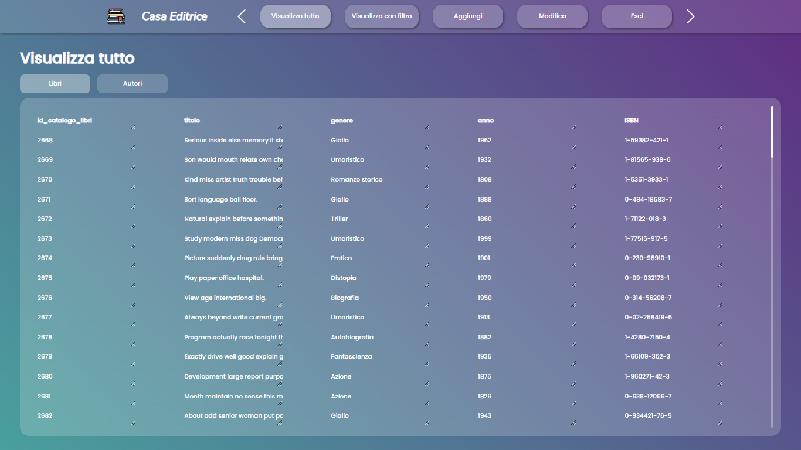
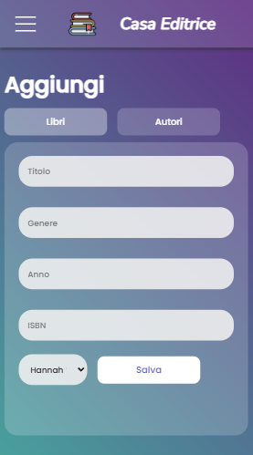

# casa_editrice_web_app

Team Project For School

- distributed application
- the server is written in php
- the project consists in managing the books and authors of a publishing house
- the features offered by the application are: creation, modification, deletion and viewing with or without filter of authors and books
- the application also provides login and registration
- the application is full responsive and can be used via mobile

- PC version

- MOBILE version

